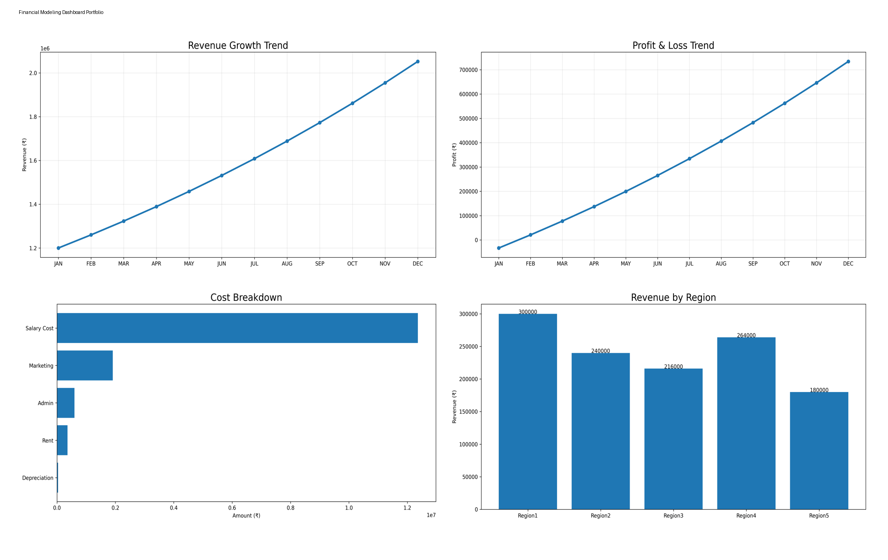
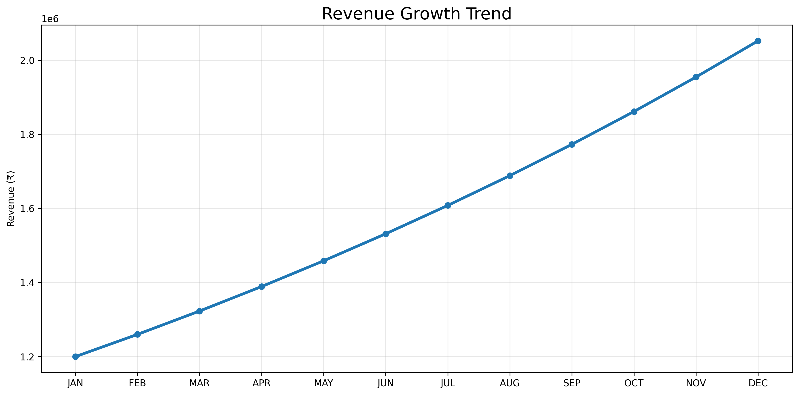
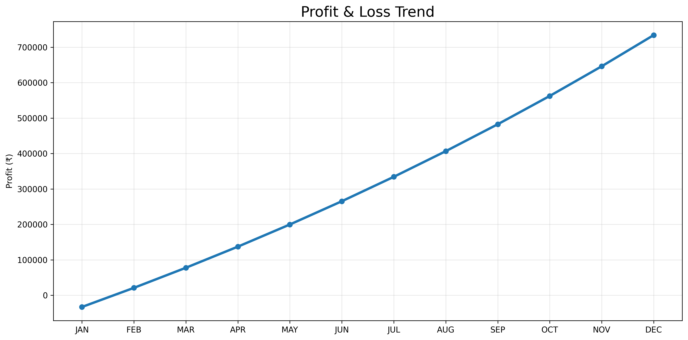
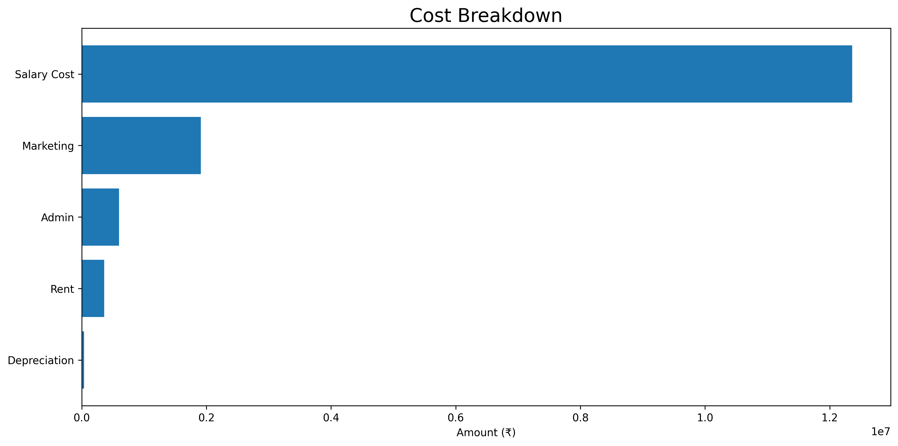
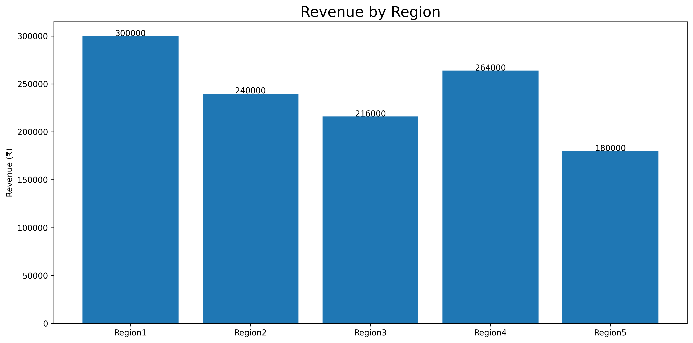

# Financial Modeling & FP&A Dashboard

## Project Overview

This project demonstrates an end-to-end Financial Planning & Analysis (FP&A) model built in Microsoft Excel.

The model forecasts revenue, analyzes costs, generates financial statements, tracks regional performance, and presents executive-level insights through an interactive dashboard.

---

## Business Objective

Develop a financial model capable of:

- Revenue Forecasting
- Cost Analysis
- Profitability Tracking
- Regional Performance Monitoring
- Executive Dashboard Reporting

---

## Key Business Insights

- Revenue increased from ₹12 Lakhs to ₹20 Lakhs+ during the forecast period.
- Profitability improved consistently throughout the year.
- Salary expenses account for the largest share of operating costs.
- Region 1 and Region 4 generated the highest revenue contribution.

---

## Dashboard Highlights

### Revenue Growth Trend

---

### Profit & Loss Trend

---

### Cost Breakdown

---

### Revenue by Region

---

## Model Components

- Assumptions
- Revenue Forecasting
- Cost Analysis
- Profit & Loss Statement
- Cash Flow Statement
- Balance Sheet
- Variance Analysis
- Regional Performance Analysis
- Executive Dashboard
- Business Insights

---

## Skills Demonstrated

### Financial Modeling
- Forecasting
- Scenario Planning
- Financial Statement Modeling

### FP&A
- Budgeting
- Variance Analysis
- Profitability Analysis

### Business Analytics
- KPI Tracking
- Trend Analysis
- Regional Performance Analysis

### Microsoft Excel
- Advanced Formulas
- Dashboard Development
- Data Visualization

---

## Tools Used

- Microsoft Excel
- Financial Modeling
- FP&A Techniques
- Dashboard Reporting

---

## Author

**Vrushab Das**

Data Analyst | Business Analyst | Financial Modeling Enthusiast
